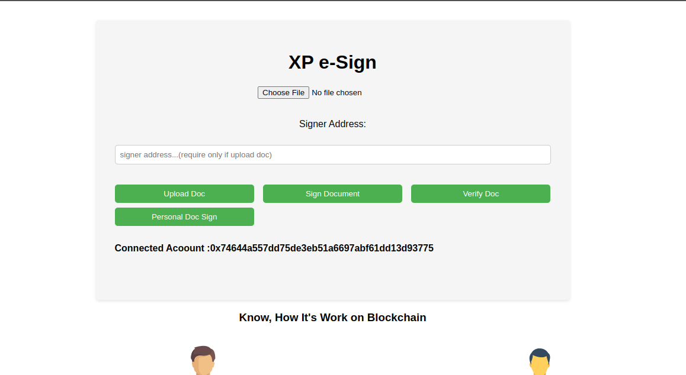

# XP-e-Sign


XP e-Sign is a web-based application that allows users to upload, sign, and verify documents securely using blockchain technology.

## Features

- **Upload Document**: Upload a document to the platform for signing.
- **Sign Document**: Sign a document using your Ethereum account.
- **Verify Document**: Verify the authenticity of a signed document.
- **Personal Doc Sign**: Sign a document without requiring a specific signer address.

## Prerequisites

- MetaMask extension installed and configured in your web browser.
- Access to an Ethereum account with sufficient funds for gas fees.

## How to Use

1. Clone the repository:

```bash
git clone https://github.com/your_username/xp-e-sign.git
```

2. Open the `index.html` file in your web browser.

3. Connect your MetaMask account to the application.

4. Select a file to upload and optionally provide the signer's address.

5. Click the corresponding button to perform the desired action (Upload Doc, Sign Document, Verify Doc, Personal Doc Sign).

## Technologies Used

- HTML
- CSS (style.css)
- JavaScript (App.js)
- Web3.js for Ethereum blockchain integration
- -Solidity 

## Screenshots



## Contributors

- [ryzen_xp](https://github.com/your_username)

## License

This project is licensed under the MIT License. See the [LICENSE](LICENSE) file for details.

---

Feel free to customize the content and structure according to your project's specifications. You can also add more sections such as Installation, Usage, Troubleshooting, etc., if needed.
